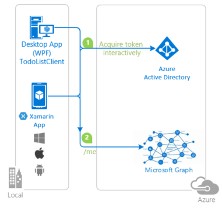
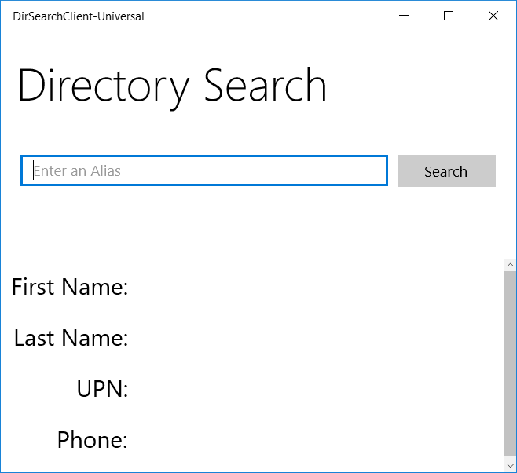

# Integrating Azure AD into a cross platform Xamarin application

## About this sample

### Overview

This sample solution shows how to build a native application that uses Xamarin to target several different platforms with a single shared C# code base.  The application:

1. signs users in with Azure Active Directory (AAD), using the Active Directory Authentication Library (ADAL) to obtain a JWT access token through the OAuth 2.0 protocol.
2. The access token is sent to the Microsoft Graph API to authenticate the user and obtain information about other users in their organization.

    

### Scenario

The user enters an alias in the organization of interest and presses search. If needed, the user is asked to sign in to that organization and to consent for the application to read user's basic profile. 
Then, if the alias is found in the user's organization, the profile of the corresponding user is written in the UI. This profile consists in first name, last name, email address, and phone number. The picture below shows the UI for a UWP application, but it's really the same for other platforms.

## How to run the sample

To run this entire sample, you'll need:

- An Internet connection
- A Windows machine (necessary if you want to run the Windows Store or WPF apps)
- An OS X machine (necessary if you want to run the iOS app)
- Visual Studio 2017 (recommended) which comes with Xamarin for iOS, Android, and Universal platform;
- An Azure subscription (a free trial is sufficient)

Every Azure subscription has an associated Azure Active Directory tenant.  If you don't already have an Azure subscription, you can get a free subscription by signing up at [https://azure.microsoft.com](https://azure.microsoft.com).  All of the Azure AD features used by this sample are available free of charge.
This sample will not work with a Microsoft account (formerly Windows Live account). Therefore, if you signed in to the [Azure portal](https://portal.azure.com) with a Microsoft account and have never created a user account in your directory before, you need to do that now.

### Step 1: Set up your Xamarin development environment

We recommend you begin with the [Xamarin Download Page](https://xamarin.com/download), installing Xamarin on both your Mac and PC.  If you don't have both machines available, you can still run the sample, but certain projects will have to be omitted.  Follow the [detailed installation guides](http://developer.xamarin.com/guides/cross-platform/getting_started/installation/) for iOS and Android, and if you would like to understand more about the options available to you for development, have a look at the [Building Cross Platform Applications](http://developer.xamarin.com/guides/cross-platform/application_fundamentals/building_cross_platform_applications/part_1_-_understanding_the_xamarin_mobile_platform/) guide.  You do not need to set up a device for development at this time. You don't need an Apple Developer Program subscription either (unless you want to run the iOS app on a device).

For this sample, we recommend that you use the Visual Studio Integration to run the sample in Visual Studio, and connect to your OS X machine by [pairing via the Xamarin Build Host](http://developer.xamarin.com/guides/ios/getting_started/installation/windows/), which comes as part of your Xamarin for OS X installation.

### Step 2:  Clone or download this repository

Once you've completed your IDE setup, from your IDE or the command-line, run:

`git clone https://github.com/Azure-Samples/active-directory-dotnet-native-multitarget.git`

or download and extract the repository .zip file.

### Step 3:  Create user(s) in your Azure Active Directory tenant

For this sample, you must have at least one user homed in the AAD tenant in which you will register the application.  You can't run the sample with your Microsoft Account, so create a new user with the same domain as your tenant if necessary.

### Step 4:  Register the sample with your Azure Active Directory tenant

This step and the following are optional. Indeed, the sample is configured to run with any tenant out of the box.  But for best understanding, we recommend completing these two steps and registering the application in your own tenant.

1. Sign in to the [Azure portal](https://portal.azure.com).
1. On the top bar, click on your account and under the **Directory** list, choose the Active Directory tenant where you wish to register your application.
1. Click on **All services** in the left-hand nav, and choose **Azure Active Directory**.
1. In the  **Azure Active Directory** pane, click on **App registrations** and choose **New application registration**.
1. Enter a friendly name for the application, for example 'MyDirectorySearcherApp' and select 'Native' as the *Application Type*.
1. For the *Redirect URI*, enter `https://<your_tenant_name>/MyDirectorySearcherApp`, replacing `<your_tenant_name>` with the name of your Azure AD tenant.
1. Click on **Create** to create the application.
1. In the succeeding page, Find the *Application ID* value and copy it to the clipboard. You'll need it to configure the Visual Studio configuration file for this project.
1. Then click on **Settings**, and choose **Properties**.
1. For the App ID URI, replace the guid in the generated URI 'https://\<your_tenant_name\>/\<guid\>', with the name of your service, for example, 'https://\<your_tenant_name\>/MyDirectorySearcherApp' (replacing `<your_tenant_name>` with the name of your Azure AD tenant)
1. Configure Permissions for your application. To that extent, in the Settings menu, choose the 'Required permissions' section and then,
   click on **Add**, then **Select an API**, and type `Microsoft Graph` in the textbox.
   Then, click on  **Select Permissions** and select the permissions:
   In the "Enable Access" pane, in the "Delegated permissions" section, check the "Sign in and read user profile" and "Read all user's basic profiles".
   These permissions don't require admin consent and therefore you won't require a tenant admin to approve the application. Press **Select** at the bottom of the pane, and then **Done** in the "Add API access pane"

### Step 5:  Configure the sample to use your Azure AD tenant

1. Open the solution in Visual Studio 2015.
2. Open the `DirectorySearcherLib\DirectorySearcher.cs` file in the `DirectorySearcherLib (Portable)` project.
3. Find the `clientId` member variable and replace its value with the Client ID you copied from the Azure portal.
4. Find the `returnUri` member variable and replace the value with the redirect Uri you registered in the Azure portal.

### Step 6:  Run the sample(s)

Clean the solution, rebuild the solution, and run it!  Explore each platform by running each project. Searching for users by their alias, logging in with users in your tenant, and viewing results.  You'll notice that the user needs to consent to the app on first login. This consent is required because the app is configured to work with any tenant.  If you would like to remove this consent flow, see the comments in the `Directory Searcher` class.

> Note that if your organization requires Multiple Factor Authentication (MFA), and you try to use the PIN, the certificate will be proposed, but the PIN window won't be presented. This is a known issue with WIA. As a workaround, you might want to use phone authentication (proposed as alternative ways of doing MFA)

## About the code

This sample solution is a "Directory Searcher" that contains five projects, implementing a common component and apps for four different target platforms: iOS, Android, Universal Windows Platform, and WPF.  The solution is built using the [Xamarin Platform](http://xamarin.com/platform), which allows all four applications to be written in C# and ported to the corresponding platform.  Each application contains two major portions: a platform-specific project that is used primarily for UI, and a shared portable class library (PCL) that contains the application logic.

In this application, the platform-specific projects are effectively only responsible from presenting the UI. Each application receives an input search term from the user, and calls a method `SearchByAlias` in the application's `DirectorySearcherLib` common library.  `SearchByAlias` returns a `User` object, which is used to present information about the search results such as the user's name, user principal name, and phone number.
The `DirectorySearcherLib` PCL is the application's shared C# code base, which contains both the identity-related logic and the search-related logic.  It uses ADAL.NET v3, to:

- automatically sign users in with the OAuth 2.0 protocol,
- acquire an access token for the AAD Graph API,
- cache tokens,
- maintain user sessions

Then, the application  queries the Microsoft Graph API for information about a user with a matching alias, in the authenticated user's tenant. When the user is found, it's returned to the platform-specific UI code.  By writing both the identity and search logic in the `DirectorySearcherLib` PCL, the code only needs to be written once and can be reused across each platform.

## Community Help and Support

Use [Stack Overflow](http://stackoverflow.com/questions/tagged/adal) to get support from the community.
Ask your questions on Stack Overflow first and browse existing issues to see if someone has asked your question before.
Make sure that your questions or comments are tagged with [`adal` `dotnet`].

If you find a bug in the sample, please raise the issue on [GitHub Issues](../../issues).

To provide a recommendation, visit the following [User Voice page](https://feedback.azure.com/forums/169401-azure-active-directory).

## Contributing

If you'd like to contribute to this sample, see [CONTRIBUTING.MD](/CONTRIBUTING.md).

This project has adopted the [Microsoft Open Source Code of Conduct](https://opensource.microsoft.com/codeofconduct/). For more information, see the [Code of Conduct FAQ](https://opensource.microsoft.com/codeofconduct/faq/) or contact [opencode@microsoft.com](mailto:opencode@microsoft.com) with any additional questions or comments.

## More information

For more information, see ADAL.NET's conceptual documentation:

- [Recommended pattern to acquire a token](https://github.com/AzureAD/azure-activedirectory-library-for-dotnet/wiki/AcquireTokenSilentAsync-using-a-cached-token#recommended-pattern-to-acquire-a-token)
- [Acquiring tokens interactively in public client applications](https://github.com/AzureAD/azure-activedirectory-library-for-dotnet/wiki/Acquiring-tokens-interactively---Public-client-application-flows)
- [Customizing Token cache serialization](https://github.com/AzureAD/azure-activedirectory-library-for-dotnet/wiki/Token-cache-serialization)

For more information about how OAuth 2.0 protocols work in this scenario and other scenarios, see [Authentication Scenarios for Azure AD](http://go.microsoft.com/fwlink/?LinkId=394414).
